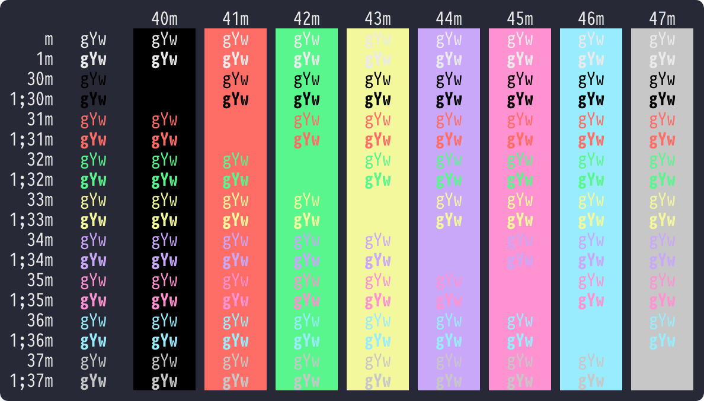

# [Dracula](https://draculatheme.com/) for [Blink](https://blink.sh/)

> A dark theme for [Blink Shell](https://blink.sh/).

## How to install

- Install [Blink Shell](https://apps.apple.com/app/id1156707581) on your iOS Device.
- Enter `config` to turn on the configuration window.
- Just paste the URL of the JS theme under `Appearance` > `Themes` > `New Theme`.
  - Dracula: [https://raw.githubusercontent.com/hwyncho/Dracula-Blink/master/Dracula.js](https://raw.githubusercontent.com/hwyncho/Dracula-Blink/master/Dracula.js)

## License

[MIT License](./LICENSE)